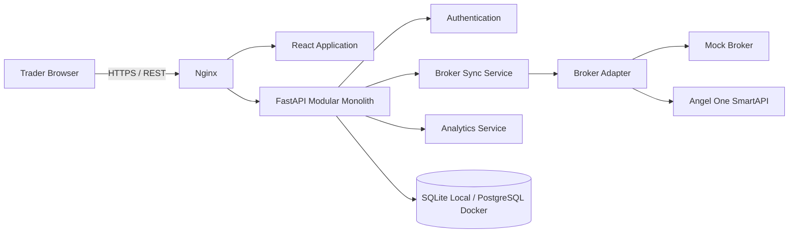
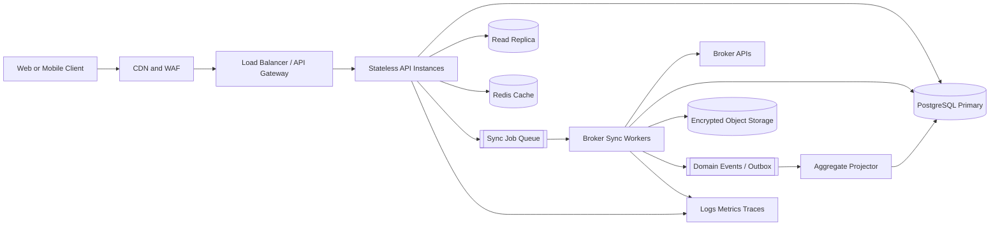

# TradeOS System Design Interview Guide

This document is the entry point for explaining TradeOS in a system design round. It describes the product problem, establishes scope and scale, presents the design in a logical interview order, and links to the detailed high-level and low-level designs.

## 1. One-Minute Product Summary

TradeOS is a read-only decision-support workspace for Indian swing traders. A user connects a broker, manually imports account and trade data, views portfolio and performance metrics on a dashboard, and investigates individual trades in a spreadsheet-style analysis grid.

The current product deliberately excludes price prediction, buy/sell recommendations, and order execution. That keeps the first version focused on trustworthy data ingestion and explainable analytics.

The first working slice contains:

- Email/password authentication
- Angel One SmartAPI connection boundary
- Mock broker for deterministic development and demonstrations
- Manual broker synchronization
- Trading KPIs, equity curve, drawdown, daily P&L, and profit calendar
- Filterable and sortable trade analysis grid with CSV export
- SQLite for local development and PostgreSQL for Docker deployment

## 2. Design Documents

- [High-Level Design](21_HIGH_LEVEL_DESIGN.md): boundaries, components, data flow, scale, reliability, security, and deployment
- [Low-Level Design](22_LOW_LEVEL_DESIGN.md): modules, classes, tables, API contracts, state machines, algorithms, and test seams
- [Architecture Improvement Plan](23_ARCHITECTURE_IMPROVEMENT_PLAN.md): current gaps and prioritized evolution from MVP to production scale

The existing product specifications remain useful supporting material:

- [Product Vision](01_PRODUCT_VISION.md)
- [Requirements](02_REQUIREMENTS.md)
- [Broker Layer](06_BROKER_LAYER.md)
- [Analytics Engine](08_ANALYTICS_ENGINE.md)
- [Security](13_SECURITY.md)
- [Development Roadmap](16_DEVELOPMENT_ROADMAP.md)

## 3. How To Start The Interview

Begin by clarifying the problem before drawing components.

Suggested opening:

> I will design a read-only trading analytics platform. Users connect a broker, trigger a manual synchronization, and inspect normalized trades through a dashboard and analysis grid. I will optimize first for correctness, security, and broker isolation. Order execution and AI coaching are future extensions, not requirements for this design.

Then ask or state the following assumptions:

### Functional Requirements

1. Register and authenticate users.
2. Connect an Angel One account without persisting PIN or TOTP.
3. Fetch profile, holdings, orders, trades, positions, and RMS data.
4. Allow users to initiate a manual synchronization and see its status.
5. Store normalized trading records idempotently.
6. Show dashboard metrics and time-series visualizations.
7. Support search, filtering, sorting, pagination, and export in the analysis grid.
8. Keep the broker integration read-only.

### Non-Functional Requirements

1. Never expose one user's trading records to another user.
2. Do not store broker PIN, password, or TOTP.
3. Encrypt persistent broker keys and session tokens.
4. Make repeated synchronization safe and idempotent.
5. Return dashboard reads quickly even when broker APIs are slow.
6. Recover gracefully from broker timeouts, expired sessions, and partial responses.
7. Maintain an audit trail for authentication and broker operations.
8. Scale reads and broker jobs independently when usage grows.

### Explicitly Out Of Scope For The First Version

- Live price streaming
- Stock prediction
- Buy/sell recommendations
- Automated order placement
- Backtesting and replay
- AI coaching
- Full multi-broker support, although the adapter boundary prepares for it

## 4. Capacity Assumptions

Capacity numbers should be agreed during the interview. The following are reasonable design targets rather than claims about current usage.

| Dimension | Initial target | Growth target |
|---|---:|---:|
| Registered users | 10,000 | 100,000 |
| Daily active users | 1,000 | 10,000 |
| Broker accounts per user | 1-2 | 1-3 |
| Historical trades per active user | 2,000 | 5,000 |
| Manual syncs per active user per day | 2 | 5 |
| Peak dashboard reads | 20 requests/second | 200 requests/second |
| Peak sync starts | 5 jobs/second | 50 jobs/second |
| Availability objective | 99.5% | 99.9% |
| Dashboard latency objective | p95 below 500 ms | p95 below 300 ms |

At 100,000 users and 5,000 normalized trades per user, the upper bound is roughly 500 million trade rows. At that point, table partitioning, incremental aggregates, archival, and read replicas become justified. They are unnecessary complexity for the current MVP.

## 5. Core Architectural Decision

TradeOS starts as a modular monolith, not as many microservices.

Why this is appropriate:

- One small team owns the entire product.
- Authentication, synchronization, and analytics still change together.
- The initial load is modest.
- A single transaction boundary simplifies idempotent imports.
- Deployment and local development remain straightforward.

The internal boundaries are still explicit: API routes, services, persistence, broker adapters, and analytics. This preserves an extraction path if broker workloads or analytics reads later need independent scaling.

The first component to extract should be synchronization workers because broker imports are slow, failure-prone, externally rate-limited, and naturally asynchronous.

## 6. Current And Target Design

### Current Working Design

Current manual sync is executed inside the API request. This is acceptable for a demonstrable MVP but not the final production shape because a slow broker can occupy an API worker and cause request timeouts.

### Scale-Ready Target

The target keeps the API stateless, moves broker work to asynchronous workers, stores raw payloads outside hot relational rows, and updates precomputed analytics read models through reliable events.

## 7. Target Production Sync Flow

The most important deep dive is manual synchronization.

1. The authenticated client calls `POST /api/broker/sync` with an idempotency key.
2. The API validates ownership and verifies that no active sync lock exists for that broker account.
3. The API creates a `sync_runs` row in `queued` state and commits it with an outbox event.
4. A dispatcher places the job on the queue.
5. A worker acquires a distributed lock for the broker account.
6. The adapter refreshes the broker session when necessary.
7. The worker fetches each broker resource with timeout, retry, backoff, and rate-limit handling.
8. Raw responses are encrypted and archived for traceability.
9. Broker records are normalized into canonical models.
10. Records are upserted using broker account plus broker record ID as the idempotency boundary.
11. Holdings and positions use snapshot versioning; trades and orders use immutable or append-oriented records.
12. Daily analytics aggregates are updated only for affected dates.
13. The sync run moves to `completed`, `partial`, or `failed` with per-resource details.
14. The lock is released and the client sees the result through polling or server-sent events.

This design separates acceptance of a user action from unreliable external broker work.

## 8. Data Consistency Model

TradeOS does not need distributed strong consistency for every read.

- Authentication and account ownership require strong transactional consistency.
- A sync run and its job publication require atomicity through a transactional outbox.
- Dashboard and analysis data may be eventually consistent with the broker by the age of the last successful sync.
- A single broker account should have at most one active sync to avoid overlapping snapshots.
- Repeated broker records must be safe to upsert.
- The UI must display `last_synced_at` so freshness is explicit rather than implied.

## 9. Key Tradeoffs To Explain

| Decision | Benefit | Cost | Evolution trigger |
|---|---|---|---|
| Modular monolith | Fast delivery, simple transactions and deployment | API and workers initially share a codebase | Independent scaling or team ownership becomes necessary |
| PostgreSQL | Transactions, indexes, JSON support, mature operations | Large analytical scans eventually become expensive | Hundreds of millions of rows or complex reporting |
| Adapter interface | Broker-specific behavior is isolated | Lowest-common-denominator contract can hide special features | Broker-specific capabilities become product requirements |
| Manual sync | User-controlled, cheap, easy to reason about | Data is not real time | Users require scheduled or event-driven freshness |
| Precomputed daily aggregates later | Fast dashboards and predictable latency | More write complexity and eventual consistency | Dashboard scans exceed latency budget |
| Read-only broker scope | Much lower financial and operational risk | Cannot execute strategies | Product and compliance requirements approve guarded execution |

## 10. Forty-Five Minute Interview Walkthrough

### Minutes 0-5: Clarify Requirements

- State the read-only scope.
- Identify the three workflows: connect, sync, analyze.
- Clarify freshness, scale, and security expectations.
- Explicitly defer execution and AI.

### Minutes 5-8: Estimate Scale

- Estimate users, sync frequency, trade volume, and peak reads.
- Observe that external API latency dominates synchronization.
- Conclude that API reads and broker workers need different scaling paths.

### Minutes 8-13: Define APIs And Data

- Present authentication, connection, sync, dashboard, and analysis endpoints.
- Introduce user, broker account, sync run, execution, trade, and daily aggregate entities.
- Explain tenant ownership and idempotency keys.

### Minutes 13-23: Draw The High-Level Design

- Client, CDN/WAF, load balancer, stateless API, PostgreSQL, Redis, queue, workers, broker APIs, object storage, and observability.
- Explain why the code can remain a modular monolith while the runtime separates API and workers.

### Minutes 23-33: Deep Dive Into Sync

- Job states and distributed lock.
- Token refresh and encrypted secrets.
- Retries, backoff, rate limits, partial failure, and replay.
- Normalization and idempotent upserts.
- Transactional outbox and aggregate updates.

### Minutes 33-39: Deep Dive Into Analytics

- Canonical closed trades and charge calculation.
- Daily P&L aggregate and equity curve.
- Filtered cursor pagination and appropriate indexes.
- Redis caching by user, account, and filter hash.

### Minutes 39-43: Security And Reliability

- Tenant filters, HttpOnly session cookies, key management, audit logs, WAF, and rate limiting.
- Multi-AZ PostgreSQL, backups, dead-letter queue, metrics, and alerts.

### Minutes 43-45: Tradeoffs And Evolution

- Defend modular monolith first.
- State extraction triggers.
- Name the next improvements in priority order.

## 11. Short Interview Answers

### Why Not Call Broker APIs On Every Dashboard Request?

Broker APIs are slower, rate-limited, and less reliable than local storage. A dashboard should read a consistent local snapshot and clearly show its freshness. Synchronization is the boundary that converts external broker data into the internal model.

### Why Is A Queue Necessary?

A broker sync can take seconds, require retries, or partially fail. A queue keeps API latency short, limits broker concurrency, absorbs bursts, and supports retry and dead-letter handling.

### How Do You Prevent Duplicate Trades?

Use a unique key such as `(broker_account_id, broker_trade_id)` or, for executions, `(broker_account_id, exchange, broker_execution_id)`. Upsert mutable broker records and preserve immutable financial events. Also make the sync request idempotent.

### How Do You Handle A Broker Returning Partial Data?

Track status per resource in the sync run. Commit independently safe resources, mark the run `partial`, retain the previous successful snapshot for failed resources, and allow replay. Do not replace a complete snapshot with an empty response unless the broker explicitly confirms that it is complete.

### How Do You Keep Dashboard Metrics Fast?

For the MVP, calculate metrics from normalized trades. At scale, maintain daily account aggregates and cumulative snapshots incrementally, cache common date ranges, and query a read replica.

### How Do You Add Another Broker?

Implement the canonical adapter contract, map broker-specific fields into canonical executions and snapshots, add contract tests using recorded responses, and register the adapter through a factory. Analytics remains broker-independent.

### Why PostgreSQL Instead Of A Time-Series Database?

The workload needs transactional ownership, idempotent upserts, flexible filtering, and joins more than high-frequency tick ingestion. PostgreSQL fits the current data shape. A columnar warehouse can be added later for cross-account analytical workloads without replacing the transactional source of truth.

### What Is The Biggest Current Technical Risk?

The current synchronous broker sync couples API availability to an external service. Moving it to an idempotent worker pipeline is the highest-value architectural improvement.

## 12. What Is Implemented Versus Proposed

| Area | Implemented now | Production target |
|---|---|---|
| Application shape | React plus FastAPI modular monolith | Same code boundaries, separately scalable API and workers |
| Persistence | SQLite local, PostgreSQL Docker | Managed PostgreSQL, migrations, backups, replica |
| Broker sync | Synchronous manual request | Queued idempotent job with locks and retries |
| Analytics | Computed from trade rows per request | Incremental daily read models plus cache |
| Secrets | Fernet-encrypted broker material | Managed KMS envelope encryption and rotation |
| Web auth | Bearer JWT in browser storage | Short-lived secure HttpOnly cookie plus refresh rotation |
| Raw payload | JSON in broker account/trade rows | Encrypted object storage with retention policy |
| Observability | Application logs and health endpoint | Structured logs, metrics, traces, dashboards, alerts |
| Schema changes | SQLAlchemy `create_all` | Versioned migrations and backward-compatible rollout |
| Multi-broker | Interface plus mock and Angel One | Adapter registry, capability model, contract certification |

This distinction is valuable in an interview. It demonstrates that the system is real, that its current constraints are understood, and that scaling decisions are tied to measurable triggers.
