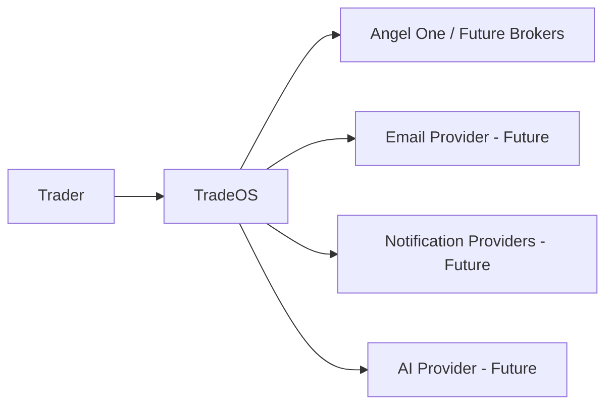
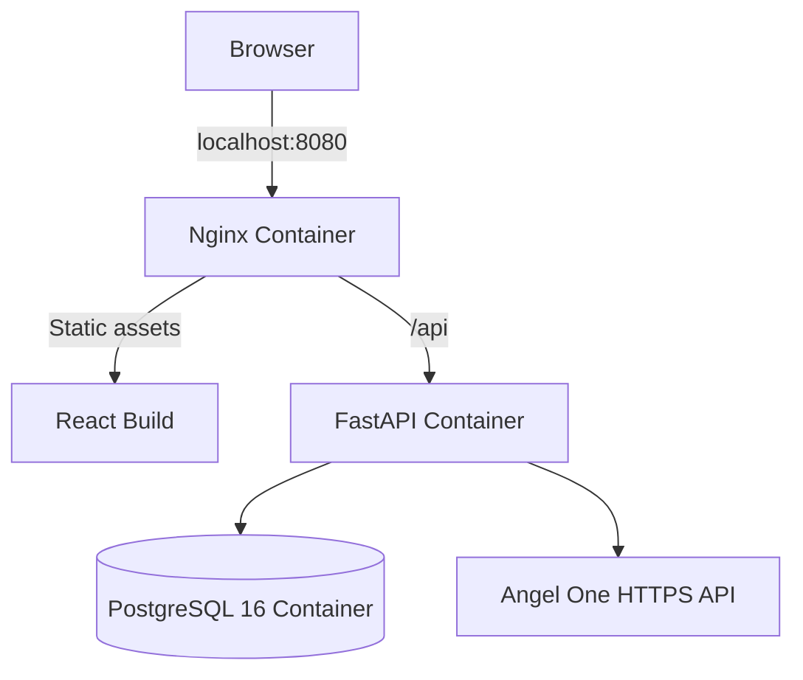
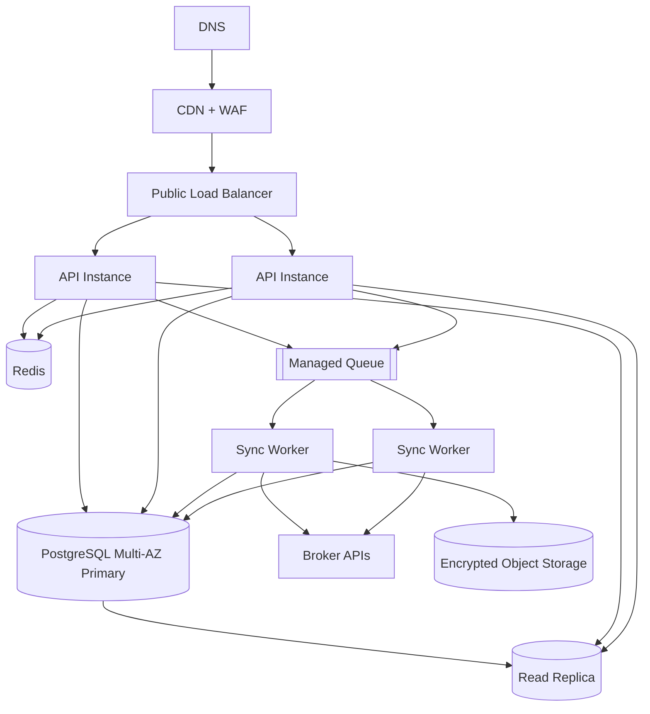
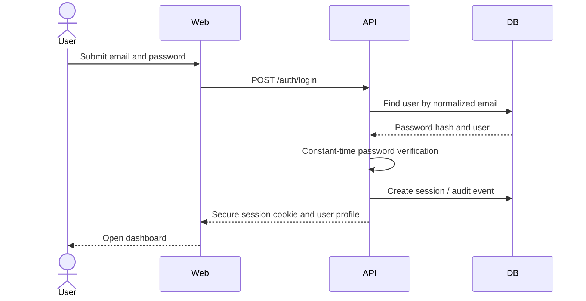
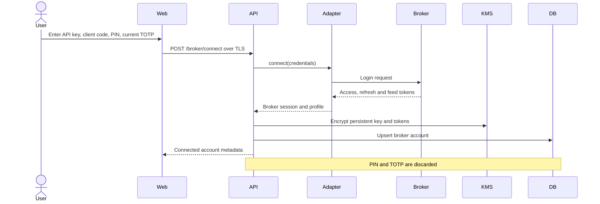
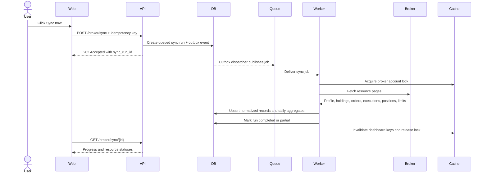
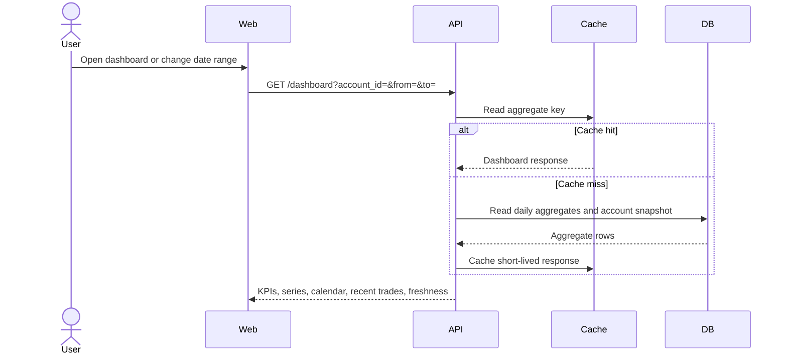

# TradeOS High-Level Design

## 1. Purpose

This HLD defines the major runtime components, ownership boundaries, data flows, reliability model, security posture, and scale path for TradeOS.

## 2. System Context



TradeOS owns authentication, broker connection metadata, normalized trading history, analytics, and user-facing presentation. The broker remains the authority for account state and execution records. TradeOS is a read model whose freshness is determined by the most recent successful sync.

## 3. Logical Components

### Web Client

Responsibilities:

- Authentication experience
- Dashboard, broker connection, sync controls, and analysis grid
- Responsive state and local interaction
- Server-backed filtering and pagination at scale
- Clear freshness, progress, and failure states

Current implementation: React, TypeScript, React Router, Recharts, AG Grid Community, and Lucide icons.

### Edge And Web Delivery

Responsibilities:

- TLS termination
- Static asset delivery
- CDN caching for versioned frontend assets
- WAF rules and basic abuse protection
- Reverse proxying `/api` requests
- Compression and security headers

Current implementation: Nginx in Docker. Target: managed CDN, WAF, and load balancer.

### Application API

Responsibilities:

- Request validation and authentication
- Tenant and resource ownership enforcement
- Broker connection workflow
- Sync job creation and status reads
- Dashboard and grid queries
- Stable external API contracts

The API must remain stateless so instances can scale horizontally.

### Authentication Module

Responsibilities:

- User registration and login
- Password hashing
- Session/token issuance and validation
- Session revocation and refresh in the target design
- Login rate limiting and security audit events

### Broker Connection Module

Responsibilities:

- Validate a broker session using ephemeral PIN and TOTP
- Encrypt API keys and session material
- Refresh or invalidate sessions
- Expose broker capabilities without leaking broker-specific fields into analytics

### Sync Orchestrator

Responsibilities:

- Accept manual synchronization requests
- Enforce one active sync per broker account
- Create and transition sync runs
- Publish jobs reliably
- Report resource-level progress

Current implementation runs synchronization inline. Target implementation publishes jobs through a transactional outbox.

### Broker Workers

Responsibilities:

- Apply broker-specific rate limits
- Refresh tokens
- Fetch profile, holdings, orders, trades, positions, and RMS data
- Retry transient failures with bounded exponential backoff
- Normalize broker payloads
- Upsert canonical records
- Store raw payload archives
- Emit data-changed events

### Broker Adapter Layer

The canonical adapter prevents the rest of TradeOS from depending on Angel One field names or authentication details.

```text
BrokerAdapter
  connect(ephemeral_credentials) -> BrokerSession
  refresh_session(session) -> BrokerSession
  fetch_profile(session) -> BrokerProfile
  fetch_holdings(session) -> list[HoldingSnapshot]
  fetch_orders(session, cursor) -> page[BrokerOrder]
  fetch_executions(session, cursor) -> page[BrokerExecution]
  fetch_positions(session) -> list[PositionSnapshot]
  fetch_limits(session) -> FundsSnapshot
```

Each adapter also declares capabilities such as historical range, pagination, token lifetime, and supported product types.

### Normalization Module

Responsibilities:

- Convert broker-specific enums and identifiers to canonical values
- Parse all dates into UTC-aware timestamps
- Preserve original broker IDs
- Separate immutable executions from derived round-trip trades
- Validate numeric precision and required fields
- Quarantine malformed records instead of silently inventing values

### Portfolio And Trade Engine

Responsibilities:

- Pair executions into logical trades
- Track open and closed quantities
- Calculate realized and unrealized P&L
- Calculate brokerage, taxes, and fees by instrument and date
- Produce account and daily snapshots

This module is planned; the MVP currently receives already-closed demo trades and treats live broker executions as execution-like rows.

### Analytics Query Module

Responsibilities:

- Dashboard KPIs
- Daily and cumulative P&L
- Drawdown series
- Profit calendar
- Filtered trade ledger
- Export jobs

It reads canonical tables and, at scale, precomputed read models.

### Persistence

PostgreSQL is the transactional source of truth for users, broker accounts, sync state, normalized records, and aggregates.

Recommended supporting stores:

- Redis for cache, distributed locks, rate limits, and short-lived progress
- Object storage for encrypted raw broker payloads and large exports
- Optional analytics warehouse later for long-range reports across hundreds of millions of rows

### Observability

Responsibilities:

- Structured logs with request, user, broker account, and sync correlation IDs
- API latency and error metrics
- Queue depth and job age
- Broker latency, errors, and rate-limit metrics
- Database query duration and pool saturation
- Distributed traces from API acceptance through worker completion
- Alerts tied to service-level objectives

## 4. Current Deployment



Docker Compose provides a reproducible local environment. SQLite remains the no-configuration backend default outside Docker.

## 5. Production Deployment



Deploy the API and worker from the same versioned application image with different process commands. This retains shared domain code while allowing independent autoscaling.

## 6. Data Flows

### Authentication



The target uses a short-lived secure HttpOnly cookie plus a rotating refresh session. The current implementation issues a seven-day bearer JWT stored by the browser.

### Broker Connection



### Asynchronous Manual Sync



### Dashboard Query



## 7. Reliability Design

### Broker Failures

- Set connect and read timeouts on every request.
- Retry only transient statuses and network failures.
- Use exponential backoff with jitter.
- Respect broker retry and rate-limit headers.
- Use a circuit breaker to stop amplifying a broker outage.
- Bound retries and move exhausted jobs to a dead-letter queue.
- Preserve per-resource results so a partial run is diagnosable.

### Duplicate Job Delivery

Queues are normally at-least-once. Workers therefore must be idempotent.

- Unique sync request key per user action
- Unique broker record constraints
- Upserts for mutable records
- Immutable execution identity
- Compare-and-set sync state transitions
- One distributed lock per broker account

### Database Failure

- Multi-AZ managed PostgreSQL
- Automated point-in-time recovery
- Connection pool limits per application instance
- Readiness checks that include a lightweight database probe
- Backward-compatible migrations
- Read replica for expensive read paths

### Cache Failure

Redis is an optimization and coordination layer, not the source of truth. Dashboard reads should fall back to PostgreSQL. Lock acquisition must fail safe: if lock state is unknown, do not launch overlapping syncs.

### Deployment Failure

- Immutable images
- Rolling or blue/green release
- Readiness and liveness probes
- Expand-migrate-contract schema changes
- Automatic rollback based on error rate and latency

## 8. Security Design

### Identity And Session

- PBKDF2, bcrypt, scrypt, or Argon2id password hashing with per-user salt
- Secure HttpOnly, SameSite cookies in the target web design
- Short access lifetime and rotating refresh sessions
- Login throttling by account and IP
- Session revocation on password change or suspicious activity

### Authorization

Every query includes the authenticated `user_id` or a verified ownership join. Resource IDs alone are never trusted. A future organization model should add `tenant_id` consistently to keys and indexes.

### Broker Secrets

- PIN and TOTP exist only in request memory for the connection attempt
- API keys and broker tokens use envelope encryption
- Master keys live in a managed KMS, not application configuration
- Ciphertext stores a key version to support rotation
- Logs redact authorization headers, tokens, PIN, TOTP, and broker payload fields

### Data Protection

- TLS in transit
- Database and object-storage encryption at rest
- Narrow service identities and least-privilege IAM
- Private network access for database, cache, and queue
- Raw payload retention and deletion policy
- User data export and deletion workflow

### Application Security

- Strict CORS allowlist
- Content Security Policy and other browser security headers
- Input validation and output encoding
- CSRF protection when cookie authentication is introduced
- WAF and rate limits for login, connect, sync, grid, and export endpoints
- Dependency and container vulnerability scanning

## 9. Performance And Scaling

### API

- Stateless horizontal scaling behind the load balancer
- Separate worker deployment prevents slow broker calls from occupying API capacity
- Request limits and bounded database pools prevent overload

### Database

- Composite indexes begin with tenant/account keys
- Cursor pagination for large ledgers
- Monthly or hash partitioning once trade rows become very large
- Read replicas for dashboard and ledger reads
- Archive old raw payloads and completed sync details

### Analytics

- Maintain one row per account and trading day in `daily_performance`
- Recompute only dates touched by a sync
- Cache common ranges such as current month, quarter, and all time
- Use asynchronous exports for large result sets
- Add a warehouse only when operational PostgreSQL becomes the reporting bottleneck

### Broker Workers

- Scale by queue age, not just CPU
- Limit concurrency globally and per broker
- Assign fair quotas per user to prevent one large account from starving others
- Separate queues by broker when rate limits and outage patterns differ

## 10. Service-Level Indicators

| Area | Indicator | Example objective |
|---|---|---|
| API availability | Successful non-user-error requests | 99.9% monthly |
| Dashboard latency | p95 response duration | Below 300 ms |
| Sync acceptance | p95 time to return job ID | Below 250 ms |
| Sync freshness | p95 queue wait | Below 30 seconds |
| Sync completion | Successful or explicitly partial jobs | Above 99% excluding broker outages |
| Data correctness | Duplicate canonical execution rate | Zero |
| Security | Cross-tenant access events | Zero |

## 11. Architecture Decision Records

Important decisions should be captured as short ADRs:

1. Modular monolith before microservices
2. Read-only broker integration for the initial product
3. PostgreSQL as transactional source of truth
4. Canonical broker adapter and capability model
5. Asynchronous synchronization with at-least-once delivery
6. Transactional outbox for job and domain-event publication
7. Incremental daily performance read model
8. Managed KMS for persistent broker secrets

Each ADR should include context, decision, alternatives, consequences, and a reconsideration trigger.

