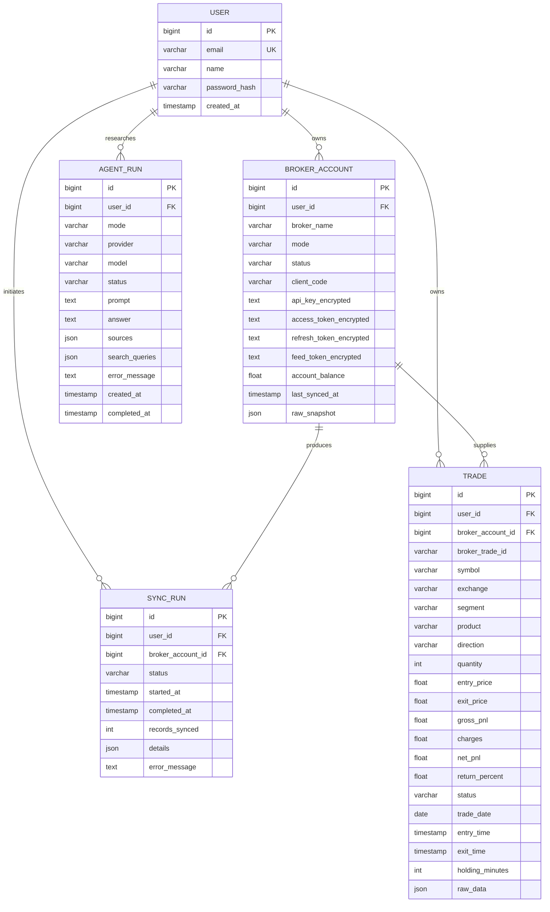
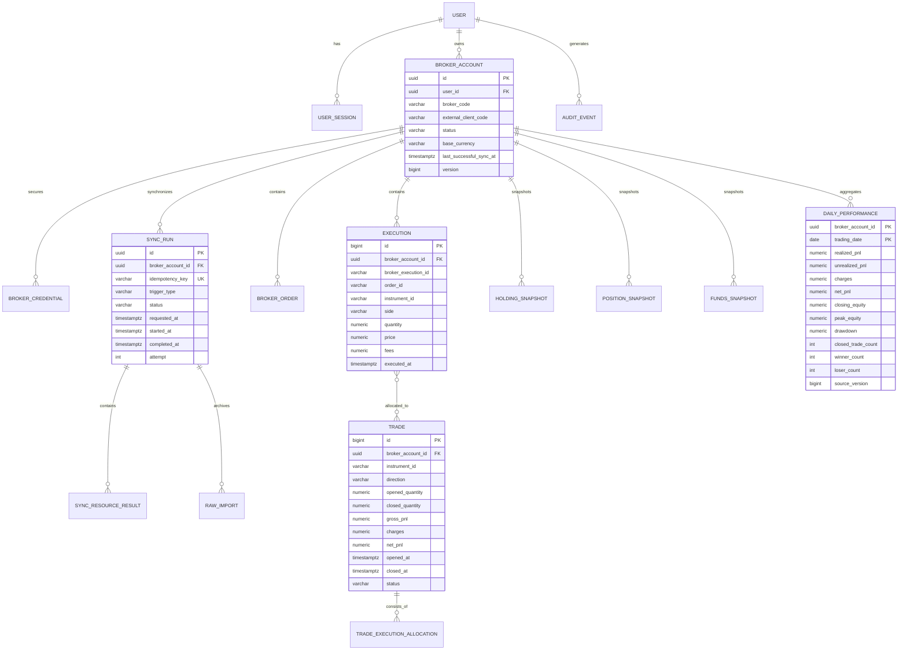
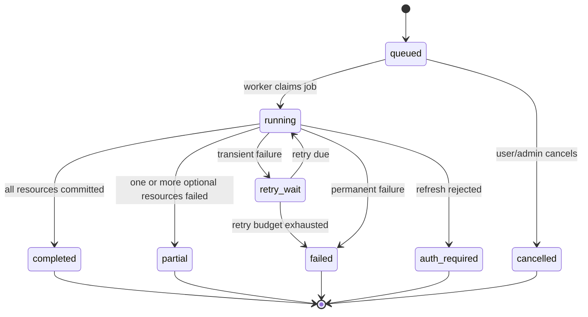

# TradeOS Low-Level Design

## 1. Purpose

This LLD translates the TradeOS architecture into implementable modules, entities, API contracts, algorithms, state transitions, indexes, and testing boundaries. Sections marked **Current** describe the code in the repository. Sections marked **Target** describe the next production-grade version.

## 2. Source Layout And Module Ownership

### Backend

```text
backend/app/
  api/
    deps.py                 authentication dependency
    routes/
      auth.py               registration, login, current user
      broker.py             connection, sync, sync history
      analytics.py          dashboard and analysis reads
      agent.py              provider status and research runs
  agent/
    contracts.py            provider-neutral research and analysis contracts
    gemini.py               Gemini Interactions API and citation parsing
    ollama.py               local model discovery, structured analysis and rendering
  broker/
    base.py                 canonical adapter protocol and snapshot types
    mock.py                 deterministic test/demo adapter
    angel_one.py            Angel One HTTPS client
  core/
    config.py               environment configuration
    security.py             password, JWT, and encryption helpers
  db/
    models.py               SQLAlchemy entities
    session.py              engine and request-scoped sessions
  schemas/
    api.py                  validated request objects
  services/
    sync_service.py         fetch, normalize, and persist broker records
    tradebook_import_service.py validate XLSX, upsert executions, and rebuild FIFO trades
    analytics_service.py    KPI and time-series calculations
    agent_service.py        run persistence and provider orchestration
  main.py                   application composition and demo seed
```

The route layer should translate HTTP into use-case calls. Business rules belong in services. Broker-specific behavior belongs in adapters. Persistence queries should move into repositories as the number of entities grows.

### Frontend

```text
frontend/src/
  components/
    AppShell.tsx            navigation and top-level workspace chrome
    MetricCard.tsx          dashboard KPI presentation
    PnLCalendar.tsx         calendar aggregation presentation
  lib/
    api.ts                  authenticated API transport
    format.ts               currency, date, and duration formatting
  pages/
    LoginPage.tsx
    DashboardPage.tsx
    BrokerPage.tsx
    AnalysisPage.tsx
    AgentPage.tsx
  App.tsx                   authentication gate and lazy routes
  types.ts                  frontend API response types
  styles.css                responsive design system and screen styles
```

Page bundles are lazy-loaded. AG Grid is therefore excluded from the initial login and dashboard JavaScript path.

## 3. Current Domain Model



Current idempotency is enforced by the unique pair `(user_id, broker_trade_id)`.

## 4. Target Domain Model

The production model separates broker executions from derived logical trades and separates current snapshots from history.



### Why Separate Execution And Trade?

A broker trade book normally represents executions or fills, not a complete round trip. One order can produce many fills, a position can be entered and exited in pieces, and multiple orders can belong to one logical trade. Treating every fill as a closed trade produces incorrect P&L and win-rate metrics.

The current manual tradebook flow keeps executions immutable and derives long-equity trades through FIFO matching. Rebuilding derived trades remains possible without losing the broker source events. The target extends this policy to charges, shorts, derivatives, corporate actions and explicit matching-policy versions.

## 5. Recommended Table Definitions

### `users`

| Column | Type | Constraints |
|---|---|---|
| `id` | UUID | Primary key |
| `email_normalized` | VARCHAR(255) | Unique, not null |
| `email_display` | VARCHAR(255) | Not null |
| `name` | VARCHAR(120) | Not null |
| `password_hash` | TEXT | Not null |
| `status` | VARCHAR(20) | `active`, `locked`, `disabled` |
| `created_at` | TIMESTAMPTZ | Not null |
| `updated_at` | TIMESTAMPTZ | Not null |

### `broker_accounts`

| Column | Type | Constraints |
|---|---|---|
| `id` | UUID | Primary key |
| `user_id` | UUID | Foreign key, not null |
| `broker_code` | VARCHAR(40) | Not null |
| `external_client_code` | VARCHAR(120) | Not null |
| `status` | VARCHAR(30) | State check constraint |
| `base_currency` | CHAR(3) | Default `INR` |
| `last_successful_sync_at` | TIMESTAMPTZ | Nullable |
| `last_attempted_sync_at` | TIMESTAMPTZ | Nullable |
| `version` | BIGINT | Optimistic concurrency counter |

Unique key: `(user_id, broker_code, external_client_code)`.

### `broker_credentials`

| Column | Type | Constraints |
|---|---|---|
| `broker_account_id` | UUID | Primary and foreign key |
| `ciphertext` | BYTEA | Not null |
| `encrypted_data_key` | BYTEA | Not null |
| `key_version` | VARCHAR(40) | Not null |
| `token_expires_at` | TIMESTAMPTZ | Nullable |
| `updated_at` | TIMESTAMPTZ | Not null |

The encrypted payload contains only persistent broker material. PIN, password, and TOTP never enter this table.

### `sync_runs`

| Column | Type | Constraints |
|---|---|---|
| `id` | UUID | Primary key |
| `broker_account_id` | UUID | Foreign key, not null |
| `requested_by_user_id` | UUID | Foreign key, not null |
| `idempotency_key` | VARCHAR(120) | Unique per broker account |
| `trigger_type` | VARCHAR(20) | `manual`, `scheduled`, `recovery` |
| `status` | VARCHAR(20) | State check constraint |
| `requested_at` | TIMESTAMPTZ | Not null |
| `started_at` | TIMESTAMPTZ | Nullable |
| `completed_at` | TIMESTAMPTZ | Nullable |
| `attempt` | INT | Default 0 |
| `error_code` | VARCHAR(80) | Nullable, sanitized |
| `error_message` | TEXT | Nullable, sanitized |

Unique key: `(broker_account_id, idempotency_key)`.

### `executions`

Use `NUMERIC`, not floating point, for financial values.

| Column | Type | Constraints |
|---|---|---|
| `id` | BIGINT | Primary key |
| `broker_account_id` | UUID | Foreign key, not null |
| `broker_execution_id` | VARCHAR(160) | Not null |
| `broker_order_id` | VARCHAR(160) | Nullable |
| `instrument_id` | VARCHAR(80) | Not null |
| `exchange` | VARCHAR(20) | Not null |
| `side` | VARCHAR(8) | `buy` or `sell` |
| `quantity` | NUMERIC(20,6) | Positive |
| `price` | NUMERIC(20,8) | Non-negative |
| `fees` | NUMERIC(20,8) | Non-negative |
| `executed_at` | TIMESTAMPTZ | Not null |
| `raw_import_id` | UUID | Foreign key |

Unique key: `(broker_account_id, broker_execution_id)`.

### `daily_performance`

Unique key: `(broker_account_id, trading_date)`.

This table is the primary dashboard read model. A source version allows the projector to reject stale updates.

## 6. Index Strategy

Indexes should match real access patterns and begin with tenant ownership.

```sql
CREATE UNIQUE INDEX uq_broker_execution
    ON executions (broker_account_id, broker_execution_id);

CREATE INDEX ix_execution_account_time
    ON executions (broker_account_id, executed_at DESC, id DESC);

CREATE INDEX ix_trade_account_close_time
    ON trades (broker_account_id, closed_at DESC, id DESC);

CREATE INDEX ix_trade_account_symbol_time
    ON trades (broker_account_id, instrument_id, closed_at DESC);

CREATE INDEX ix_trade_account_product_time
    ON trades (broker_account_id, product, closed_at DESC);

CREATE INDEX ix_daily_performance_account_date
    ON daily_performance (broker_account_id, trading_date DESC);

CREATE UNIQUE INDEX uq_active_sync_per_account
    ON sync_runs (broker_account_id)
    WHERE status IN ('queued', 'running');
```

For case-insensitive symbol search, normalize an `instrument_id` or `symbol_normalized` field. Avoid leading-wildcard `ILIKE` scans at scale. Use prefix search, trigram indexes, or a search service only if requirements justify it.

## 7. API Design

All protected endpoints derive user identity from the session. Clients never provide a trusted `user_id`.

### Current APIs

| Method | Path | Purpose | Main responses |
|---|---|---|---|
| `POST` | `/api/auth/register` | Create account | `201`, `409`, `422` |
| `POST` | `/api/auth/login` | Authenticate | `200`, `401`, `422` |
| `GET` | `/api/auth/me` | Current user | `200`, `401` |
| `GET` | `/api/broker` | Current broker metadata | `200`, `401` |
| `POST` | `/api/broker/connect` | Connect demo or Angel One | `200`, `400`, `401`, `422` |
| `POST` | `/api/broker/sync` | Run manual sync inline | `200`, `401`, `409`, `502` |
| `POST` | `/api/broker/tradebook/import` | Import and deduplicate an Angel One equity tradebook | `200`, `401`, `413`, `415`, `422` |
| `GET` | `/api/broker/sync/history` | Recent runs | `200`, `401` |
| `GET` | `/api/dashboard` | Dashboard response | `200`, `401` |
| `GET` | `/api/analysis` | Filtered normalized trades | `200`, `401`, `422` |
| `GET` | `/api/agent/status` | Provider and mode readiness | `200`, `401` |
| `GET` | `/api/agent/runs` | User-scoped research history | `200`, `401`, `422` |
| `POST` | `/api/agent/runs` | Run Gemini research or local Llama analysis inline | `200`, `401`, `409`, `422`, `502`, `503` |

The current agent endpoint persists `running` before calling the provider, then commits `completed` or `failed`. Gemini accepts research only. Llama accepts trade and portfolio modes only, using deterministic user-scoped aggregates and allowlisted portfolio fields from `analytics_service`; its JSON output is schema-validated before server-side text rendering. Provider SDK objects do not cross the adapter boundary. Citation records contain only HTTPS URLs with bounded titles and excerpts. The target version returns `202`, queues execution, streams progress and resumes from persisted checkpoints.

### Target Sync APIs

#### Start Sync

```http
POST /api/v1/broker-accounts/{account_id}/sync-runs
Idempotency-Key: 8ae8fbd1-...
```

Response:

```json
{
  "id": "c670ad77-...",
  "status": "queued",
  "requested_at": "2026-07-11T11:30:00Z",
  "status_url": "/api/v1/sync-runs/c670ad77-..."
}
```

Return `202 Accepted`. Reusing the same idempotency key returns the existing run. An already-active different run returns `409 Conflict` with its ID.

#### Read Sync Status

```http
GET /api/v1/sync-runs/{sync_run_id}
```

```json
{
  "id": "c670ad77-...",
  "status": "running",
  "progress": {
    "profile": "completed",
    "holdings": "completed",
    "orders": "running",
    "executions": "pending",
    "positions": "pending",
    "funds": "pending"
  },
  "records": {
    "holdings": 18,
    "orders": 240,
    "executions": 0
  },
  "started_at": "2026-07-11T11:30:01Z"
}
```

#### Dashboard

```http
GET /api/v1/dashboard?account_id={id}&from=2026-01-01&to=2026-07-11&timezone=Asia/Kolkata
```

Response contains:

- Account and sync freshness metadata
- KPI values and sample sizes
- Daily P&L and cumulative equity series
- Drawdown series
- Calendar buckets
- Recent trades
- Calculation version

Include a `calculation_version` so metric changes are traceable.

#### Analysis Grid

```http
GET /api/v1/trades?account_id={id}&symbol=RELIANCE&product=delivery&outcome=win&from=2026-01-01&to=2026-07-11&sort=-closed_at&limit=100&cursor={opaque}
```

```json
{
  "items": [],
  "next_cursor": "opaque-keyset-token",
  "has_more": true,
  "summary": {
    "row_count": 131,
    "net_pnl": "28742.51"
  }
}
```

Cursor pagination is preferred over large offsets because it has stable performance and avoids duplicate or skipped rows during concurrent inserts.

### Error Contract

```json
{
  "error": {
    "code": "BROKER_SESSION_EXPIRED",
    "message": "Reconnect the broker account.",
    "request_id": "req_01J...",
    "retryable": false
  }
}
```

Do not expose broker tokens, raw exceptions, SQL text, or stack traces.

## 8. Broker Adapter Contract

```python
class BrokerAdapter(Protocol):
    broker_code: str
    capabilities: BrokerCapabilities

    async def connect(self, credentials: EphemeralCredentials) -> BrokerSession: ...
    async def refresh_session(self, session: BrokerSession) -> BrokerSession: ...
    async def fetch_profile(self, session: BrokerSession) -> BrokerProfile: ...
    async def fetch_holdings(self, session: BrokerSession) -> list[HoldingRecord]: ...
    async def fetch_orders(self, session: BrokerSession, cursor: str | None) -> Page[OrderRecord]: ...
    async def fetch_executions(self, session: BrokerSession, cursor: str | None) -> Page[ExecutionRecord]: ...
    async def fetch_positions(self, session: BrokerSession) -> list[PositionRecord]: ...
    async def fetch_funds(self, session: BrokerSession) -> FundsRecord: ...
```

### Adapter Rules

1. The adapter may speak broker-specific HTTP but returns canonical typed records.
2. Every outbound request has a timeout.
3. Error mapping converts broker responses into stable internal codes.
4. Pagination is completed or explicitly marked incomplete.
5. Empty, missing, and failed responses are distinct.
6. Timestamps include a timezone or are converted using the documented broker timezone.
7. Raw payloads are returned separately for archival and never become the domain interface.

### Contract Tests

Every adapter runs the same test suite:

- Valid and invalid connection
- Expired access token refresh
- Empty account
- Multiple pages
- Duplicate record across pages
- Broker rate limit
- Timeout and retryable error
- Malformed numeric and timestamp fields
- Partial resource failure
- Redaction of secret fields from logs

## 9. Synchronization State Machine



Allowed transitions are enforced in one domain method using compare-and-set persistence. Arbitrary status assignment is prohibited.

### Resource State

Each resource has `pending`, `running`, `completed`, `failed`, or `skipped` state plus record count, cursor/checkpoint, attempt count, and sanitized error.

## 10. Synchronization Algorithm

```text
process_sync(sync_run_id):
  run = load_and_claim(sync_run_id)
  lock = acquire("broker-sync:" + run.broker_account_id, ttl)
  if lock is unavailable:
      reschedule with jitter

  try:
      account = load_owned_broker_account(run.broker_account_id)
      session = decrypt_and_refresh_session(account)

      for resource in configured_resource_order:
          mark_resource_running(run, resource)
          page_cursor = saved_checkpoint(run, resource)
          repeat:
              page = adapter.fetch(resource, page_cursor)
              validate(page)
              archive_raw_page(page)
              canonical_records = normalize(page.records)
              upsert_in_transaction(canonical_records)
              page_cursor = page.next_cursor
              save_checkpoint_and_extend_lock(page_cursor)
          until page_cursor is null
          mark_resource_completed(run, resource)

      rebuild_affected_trades()
      update_affected_daily_aggregates()
      commit_outbox_event("broker.sync.completed")
      mark_run_completed()
  except AuthenticationRejected:
      mark_account_reconnect_required()
      mark_run_auth_required()
  except RetryableBrokerError:
      schedule_retry_with_backoff()
  except Exception:
      mark_run_failed_with_sanitized_error()
  finally:
      release(lock)
```

### Retry Policy

Example bounded backoff:

```text
delay = min(base * 2^attempt, maximum) + random_jitter
base = 2 seconds
maximum = 2 minutes
maximum attempts = 5
```

Do not retry credential rejection, validation failures, or unsupported broker requests.

## 11. Transactional Outbox

The sync run and job publication must not diverge.

Within one PostgreSQL transaction:

1. Insert `sync_runs` row.
2. Insert `outbox_events` row with aggregate ID and event payload.
3. Commit.

A dispatcher claims unpublished outbox rows using `FOR UPDATE SKIP LOCKED`, publishes them, and records publication. Consumers remain idempotent because publication may occur more than once after a crash.

## 12. Trade Construction

For long-only swing trades, FIFO matching is a defensible initial rule.

```text
for each account + instrument ordered by execution time:
  on BUY:
    append quantity and price lot to open queue
  on SELL:
    remaining = sell quantity
    while remaining > 0:
      lot = oldest open buy lot
      matched = min(remaining, lot.remaining)
      gross_pnl += matched * (sell.price - lot.price)
      allocate proportional fees from both executions
      reduce lot and remaining
    close logical trade when aggregate open quantity reaches zero
```

Short selling, corporate actions, derivatives, intraday netting, and broker corrections require explicit policy extensions. The matching policy and its version must be stored with derived trades.

## 13. Analytics Algorithms

Only closed trades are included in realized trade statistics.

### Net P&L

```text
net_pnl = sum(gross_pnl - brokerage - taxes - exchange_fees - other_charges)
```

### Win Rate

```text
win_rate = winner_count / closed_trade_count * 100
```

Flat trades are excluded or included according to one documented policy. The current implementation includes flat trades in the denominator because all closed trades form the denominator and only positive trades form winners.

### Profit Factor

```text
profit_factor = sum(positive net_pnl) / abs(sum(negative net_pnl))
```

If there are no losses, return `null` or a semantic infinite value rather than a misleading zero.

### Average Win And Loss

```text
average_win = sum(winning net_pnl) / winner_count
average_loss = abs(sum(losing net_pnl)) / loser_count
```

### Trade Expectancy

Equivalent forms:

```text
expectancy = total net_pnl / closed_trade_count

expectancy = win_probability * average_win
           - loss_probability * average_loss
```

### Equity Curve And Drawdown

```text
cumulative[t] = cumulative[t-1] + daily_net_pnl[t]
peak[t] = max(peak[t-1], cumulative[t])
drawdown[t] = cumulative[t] - peak[t]
max_drawdown = min(drawdown[t])
```

For percentage drawdown, divide by peak equity only when peak equity is positive and account deposits/withdrawals have been normalized.

### Daily Aggregate Update

When a sync changes trades on dates D:

1. Recompute daily sums only for D.
2. Recompute cumulative equity and drawdown from the earliest changed date forward.
3. Update `source_version` in the same transaction.
4. Invalidate dashboard cache keys that overlap the changed dates.

## 14. Financial Precision And Time

### Precision

The current model uses Python and database floating point. The target must use:

- Python `Decimal`
- PostgreSQL `NUMERIC`
- String-encoded decimal values in JSON responses when exact client preservation matters
- Explicit rounding at regulatory or presentation boundaries, not during intermediate calculations

### Time

- Store timestamps as UTC `TIMESTAMPTZ`.
- Store the user's reporting timezone separately.
- Convert broker-local timestamps at the adapter boundary.
- Define a trading date using the exchange timezone, normally `Asia/Kolkata` for NSE data.
- Never infer an invalid timestamp as the current time; quarantine and report it.

## 15. Caching

Example dashboard cache key:

```text
dashboard:v3:{user_id}:{account_id}:{from}:{to}:{timezone}:{data_version}
```

Using `data_version` avoids broad key deletion. A successful sync increments the account data version, naturally making previous keys stale. Keep TTL short enough to bound unused keys.

Do not cache authentication failures or authorization decisions across users.

## 16. Frontend State Design

### Current

- Authentication token and user summary are stored in browser local storage.
- Each page fetches its own API data.
- Search is debounced by 220 ms.
- AG Grid applies per-column filtering to the fetched page of up to 500 rows.
- React Router pages are lazy-loaded.

### Target

- Secure HttpOnly session cookie; no access token readable by JavaScript
- Query library for caching, deduplication, retries, and invalidation
- Server-side AG Grid data source for cursor-based filtering and sorting
- URL-backed filters so analysis views are shareable and restorable
- Sync status polling with backoff, or server-sent events for active runs
- Error boundary and expired-session handling
- Accessible keyboard behavior and loading/empty/error states for every data surface

## 17. Authorization In Repositories

A safe repository method includes ownership in the same query:

```text
get_broker_account(account_id, user_id):
  SELECT *
  FROM broker_accounts
  WHERE id = :account_id
    AND user_id = :user_id
```

Avoid loading by resource ID and checking ownership later in scattered route code. Central repository methods reduce insecure direct object reference risk.

## 18. Concurrency Controls

### Active Sync

Use both:

- A partial unique database index preventing two active rows per account
- A distributed lease preventing two workers from running the same account

The database constraint protects correctness; the lease protects broker load and worker efficiency.

### Worker Lease

The worker periodically extends its lease. If it crashes, the lease expires and the queue redelivers. State and upserts make replay safe.

### Optimistic Account Version

Update account snapshots with `WHERE id = ? AND version = ?`. Increment version on success. A stale worker cannot overwrite newer data silently.

## 19. Logging And Audit Schema

### Structured Application Log

```json
{
  "timestamp": "2026-07-11T11:30:01Z",
  "level": "INFO",
  "service": "tradeos-worker",
  "event": "broker_resource_completed",
  "request_id": "req_...",
  "sync_run_id": "sync_...",
  "broker_account_id": "acct_...",
  "broker_code": "angel_one",
  "resource": "executions",
  "record_count": 240,
  "duration_ms": 843
}
```

Do not log request bodies for login or broker connection routes.

### Immutable Audit Event

Capture actor, action, resource, outcome, IP hash or controlled network metadata, timestamp, request ID, and non-secret change summary for:

- Login success and failure
- Password and session changes
- Broker connect, reconnect, and disconnect
- Manual sync request and completion
- Export request
- Administrative access

## 20. Testing Strategy

### Unit Tests

- Metric formulas and zero-value behavior
- FIFO execution matching
- Charge calculations and rounding
- Date and timezone normalization
- Sync state transitions
- Error classification and retry policy
- Secret encryption and redaction

### Contract Tests

- Adapter conformance suite
- Recorded broker response fixtures with secrets removed
- API request and response schemas
- Backward compatibility for frontend-consumed fields

### Integration Tests

- PostgreSQL unique constraints and upserts
- Transactional outbox publication
- Duplicate queue delivery
- Partial resource failure
- Expired broker token refresh
- Tenant isolation across every repository
- Redis lock expiry and recovery

### End-To-End Tests

- Register or login
- Connect demo broker
- Run manual sync and observe completion
- Dashboard freshness and metrics
- Analysis search, column filters, sorting, pagination, and export
- Expired TradeOS session
- Broker reconnect-required workflow
- Desktop and mobile layout regression

### Load And Resilience Tests

- Dashboard p95 at target concurrency
- Large account with 100,000 executions
- Burst of manual sync starts
- Broker latency and rate-limit injection
- Worker crash after raw archive but before database commit
- PostgreSQL failover
- Redis outage and queue redelivery

## 21. Current Code Seams

Useful implementation references:

- Application composition: `backend/app/main.py`
- SQLAlchemy entities: `backend/app/db/models.py`
- Authentication and encryption: `backend/app/core/security.py`
- Broker API routes: `backend/app/api/routes/broker.py`
- Broker protocol: `backend/app/broker/base.py`
- Angel One adapter: `backend/app/broker/angel_one.py`
- Sync and normalization: `backend/app/services/sync_service.py`
- Analytics formulas: `backend/app/services/analytics_service.py`
- API transport: `frontend/src/lib/api.ts`
- Analysis grid: `frontend/src/pages/AnalysisPage.tsx`
- Docker runtime: `docker-compose.yml`

These paths map directly to the logical layers described above and make the design demonstrable rather than purely theoretical.
